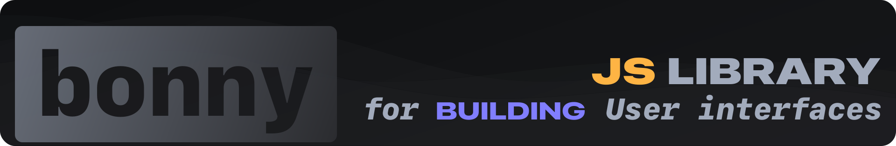

[Documentation](https://guautils.gitbook.io/bonny) (uncomplete, still gets written) | [Issues](https://github.com/guautils/bonny/issues)

---
### I try to update this Repo regularly, but cant promise the impossible.

# 
`bonny` is my own UI library, that i am gonna use in future projects. 

I wanna try to make it as optimized and lightweight as i possibly can. But i probably will fail at some points or another.

---

### Disclaimers:

Because this Project is still in development, it's not safe to be used.
Function names aren't written in Stone and can and will change over time.