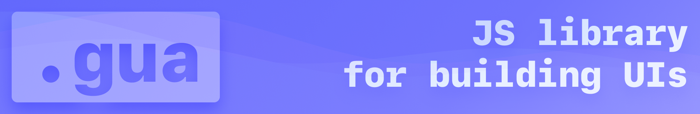

# What is `.gua`

`.gua` is my fusion of jquery with React and a sprinkle of my own ideas.

I want to challenge myself and also make a useful tool for later projects i might do.

I try to update this Repo regularly but cant promise the impossible.

# Why dont just use React and/or jquery

:^ I'm too dumb for React and jquery is older than my grand grand grand grandma..

> I want to challenge myself and see what I am capable of.